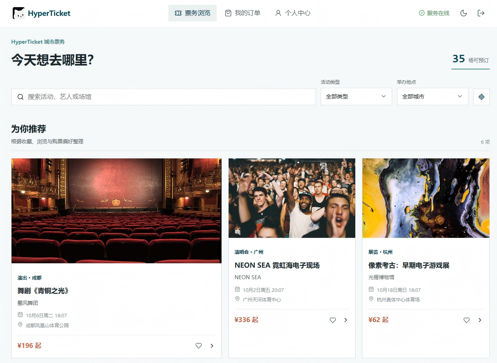
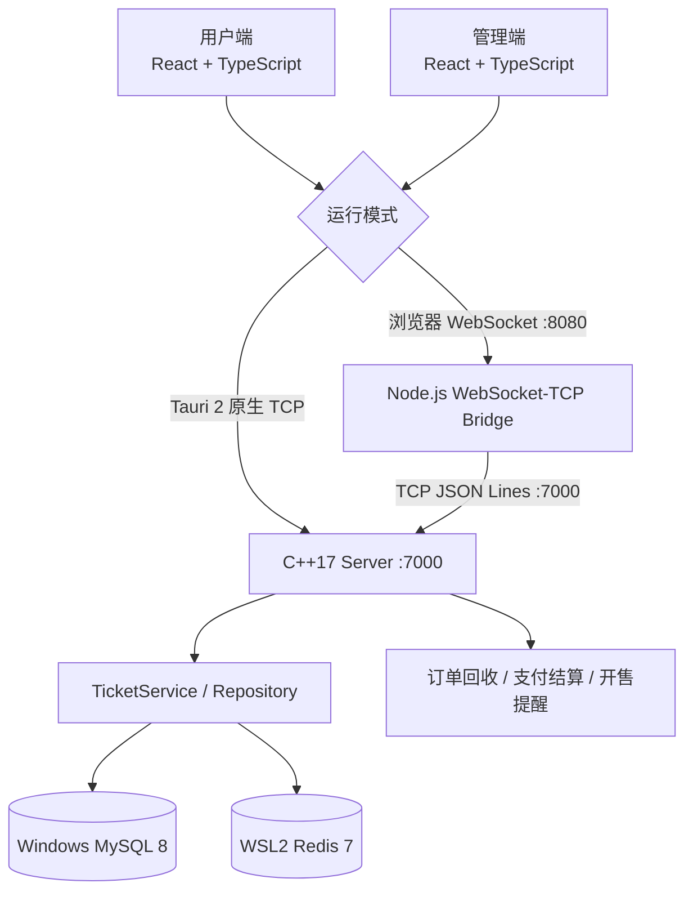
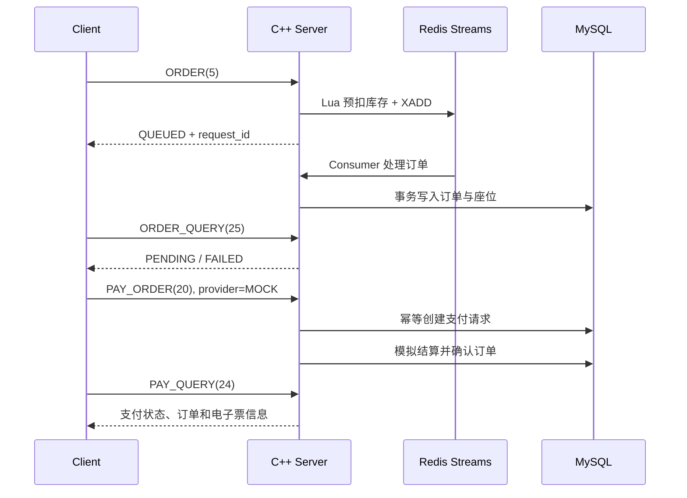

<div align="center">
  
  <h1>HyperTicket</h1>
  <p>面向完整购票生命周期的高并发票务预约系统</p>
  <p>
    <a href="https://github.com/shanchuann/HyperTicket/actions/workflows/ci.yml"></a>
    
    
    
    
    
    <a href="LICENSE"></a>
  </p>
</div>

HyperTicket 是一个 C++17 票务系统实践项目，覆盖活动目录、场次库存、选座下单、模拟支付、电子票、开售提醒、个人中心与运营管理。项目采用 Windows 托管源码和 MySQL，后端在 WSL2 中构建运行；用户端与管理端共享 React、TypeScript、Vite 和 Tauri 技术栈。

> 当前项目适合本地开发、架构验证和作品演示。`MOCK` 为默认支付 Provider；`ALIPAY`、`WECHAT` 仅提供可替换的开发占位实现，不会发生真实收款。

## 项目预览

<p align="center">
  
</p>

## 已实现能力

- 电影、演唱会、演出、脱口秀、展览、电竞赛事、体育赛事七类活动目录。
- `活动 -> 场馆/影院 -> 厅馆 -> 场次 -> 票档/座位 -> 订单` 的 v10 领域模型。
- 场次独立库存、可视化选座、多座连选、订单失败原子回滚与超时释放。
- Redis Streams 异步下单，包含请求幂等、消费者组、失败重试与 `XAUTOCLAIM` 恢复。
- 以分为单位的支付模型、客户端幂等键、支付事件、退款记录与模拟渠道。
- Redis Session、账号/IP/设备登录限制、临时锁定、验证码、密码重置和安全审计。
- 个人资料、头像、联系方式验证、订单、电子票、收藏、浏览历史和常用观演人。
- 开售提醒订阅、定时扫描、邮件发送及管理员审计视图。
- 场馆经纬度与高德地图导航入口，为后续距离筛选保留数据基础。
- 活动、场馆、厅馆、场次、票档和提醒审计的管理端维护能力。
- 35 个拟真虚构活动、70 个场次及配套座位、订单和支付演示数据。

## 系统架构



浏览器不能直接连接 TCP，需通过 `websocket-bridge` 转发；Tauri 桌面端由 Rust 命令直接访问后端 TCP。协议为以换行分隔的 JSON 消息。

## 开发环境

当前推荐拓扑：

| 组件 | 运行位置 | 默认地址 |
|---|---|---|
| 源码 | Windows | `D:\Code\C++code\HyperTicket` |
| C++ 后端 | WSL2 Ubuntu | `127.0.0.1:7000` |
| MySQL 8 | Windows | `127.0.0.1:3306` |
| Redis 7 | WSL2 | `127.0.0.1:6379` |
| WebSocket 桥接 | Windows 或 WSL2 | `ws://127.0.0.1:8080` |
| 用户端 Vite | Windows | `http://127.0.0.1:5173` |
| 管理端 Vite | Windows | `http://127.0.0.1:5174` |

## 快速开始

### 1. 安装后端依赖

在 WSL2 Ubuntu 中执行：

```bash
sudo apt update
sudo apt install -y build-essential cmake libjsoncpp-dev \
  libmysqlclient-dev libhiredis-dev redis-tools
```

确保 Windows MySQL 可从 WSL2 访问，并启动 Redis：

```bash
sudo service redis-server start
redis-cli ping
```

### 2. 准备配置与数据库

```bash
cp config.example.json config.json
cp .env.example .env
```

在 `.env` 中填写 Windows MySQL 连接信息。全新数据库先创建基础结构，再应用 v10 目录：

```bash
mysql -h 127.0.0.1 -u root -p < db/init.sql
./scripts/migrate-and-seed-v10.sh
```

迁移脚本会先把业务表数据备份到 `backups/`，保留用户、管理员、验证状态、Session 和认证安全配置，然后重建演示目录。种子脚本要求演示账号 `13008569663` 已存在。详情见 [v10 目录运行手册](docs/catalog-v10-runbook.md)。

### 3. 构建并启动后端

从 Windows PowerShell 调用 WSL2：

```powershell
wsl.exe -d Ubuntu-24.04 -- bash -lc "cd /mnt/d/Code/C++code/HyperTicket && cmake -S . -B build -DCMAKE_BUILD_TYPE=Release"
wsl.exe -d Ubuntu-24.04 -- bash -lc "cd /mnt/d/Code/C++code/HyperTicket && cmake --build build --parallel 4"
wsl.exe -d Ubuntu-24.04 -- bash -lc "cd /mnt/d/Code/C++code/HyperTicket && ./bin/ser"
```

也可在 WSL2 仓库根目录直接运行相同的 CMake 命令。服务启动后监听 TCP `7000`。

### 4. 启动浏览器客户端

分别打开终端：

```powershell
cd websocket-bridge
npm install
npm start
```

```powershell
cd clients/user-client
npm install
npm run dev
```

```powershell
cd clients/admin-client
npm install
npm run dev -- --port 5174
```

浏览器访问用户端 `http://localhost:5173` 或管理端 `http://localhost:5174`。

### 5. 启动 Tauri 桌面端

Windows 需预先安装 Rust、Node.js、Visual Studio C++ Build Tools 和 WebView2：

```powershell
cd clients/user-client
npm install
npm run tauri dev
```

管理端将路径替换为 `clients/admin-client`。Tauri 模式不需要启动 WebSocket 桥接。

## 核心流程

### 异步下单与模拟支付



订单超时、主动取消或持久化失败时，系统会释放 MySQL 座位并补偿 Redis 库存。完整设计见 [异步下单架构](docs/ASYNC_ORDER_ARCHITECTURE.md) 和 [支付 Provider 指南](docs/PAYMENT_PROVIDERS.md)。

### 开售提醒

用户订阅未开售场次后，定时任务扫描到达开售时间的记录，通过验证 Provider 发送邮件并写入审计表。场次始终校验：

```text
售票开始时间 < 售票截止时间 < 演出开始时间
```

开发环境可使用本地测试收件箱；真实邮件需要在 `.env` 配置 SMTP 授权信息。

## 测试与验证

```bash
cmake -S . -B build -DCMAKE_BUILD_TYPE=Release
cmake --build build --parallel 4
ctest --test-dir build --output-on-failure
./scripts/run-payment-e2e.sh
```

```powershell
cd clients/user-client; npm run build
cd ../admin-client; npm run build
```

当前回归基线为：CTest `12/12`、模拟支付端到端测试通过、两端 React 生产构建通过，并完成桌面与移动浏览器页面检查。GitHub Actions 会在 `main` 的 push 和 pull request 上构建后端并运行 CTest，Redis 由 CI 服务容器提供。

## 目录结构

```text
HyperTicket/
├── backend/                    # 网络、日志、线程池、领域与服务端
├── clients/
│   ├── user-client/           # React + Tauri 用户端
│   └── admin-client/          # React + Tauri 管理端
├── db/                         # 基础结构、迁移与种子数据
├── docs/                       # 架构、认证、支付和运维文档
├── scripts/                    # 迁移、测试、基准与开发脚本
├── tests/                      # C++ 单元与 Redis 集成测试
├── websocket-bridge/           # 浏览器 WebSocket 到 TCP 的桥接
├── artifacts/                  # README 首页预览图资源
├── config.example.json         # 服务端配置模板
└── CMakeLists.txt
```

## 文档索引

- [客户端开发说明](clients/README.md)
- [服务端说明](backend/Server/README.md)
- [v10 目录迁移与种子数据](docs/catalog-v10-runbook.md)
- [认证安全阶段说明](docs/AUTH_SECURITY_PHASE1.md)
- [验证码与账号生命周期](docs/AUTH_VERIFICATION.md)
- [异步下单架构](docs/ASYNC_ORDER_ARCHITECTURE.md)
- [支付 Provider 与占位渠道](docs/PAYMENT_PROVIDERS.md)
- [Redis 高并发库存](docs/REDIS_HIGH_CONCURRENCY.md)
- [WebSocket 集成](docs/WEBSOCKET_INTEGRATION.md)
- [自动发布与部署工作流](docs/RELEASE_WORKFLOW.md)
- [后端差距与下一阶段](docs/BACKEND_GAP_ANALYSIS.md)
- [v2 历史版本说明](docs/V2_FEATURES.md)

## 生产化边界

项目尚未接入持牌真实支付渠道，也不宣称达到商业票务平台的生产能力。公开售票前至少还需要：

- 活动级排队、反爬、风控挑战和账号/设备/IP 配额。
- HTTPS/WSS 网关、真实支付 webhook 验签、查单、关单和每日对账。
- MySQL、Redis、订单与座位库存的持续一致性巡检和异常处置队列。
- 密钥托管、隐私合规、备份恢复演练、容灾目标和容量压测。
- 二维码轮换、转赠规则、入场核销幂等与运营人工处理流程。

## License

项目使用 [MIT](LICENSE) 许可证，详见 LICENSE 文件。
