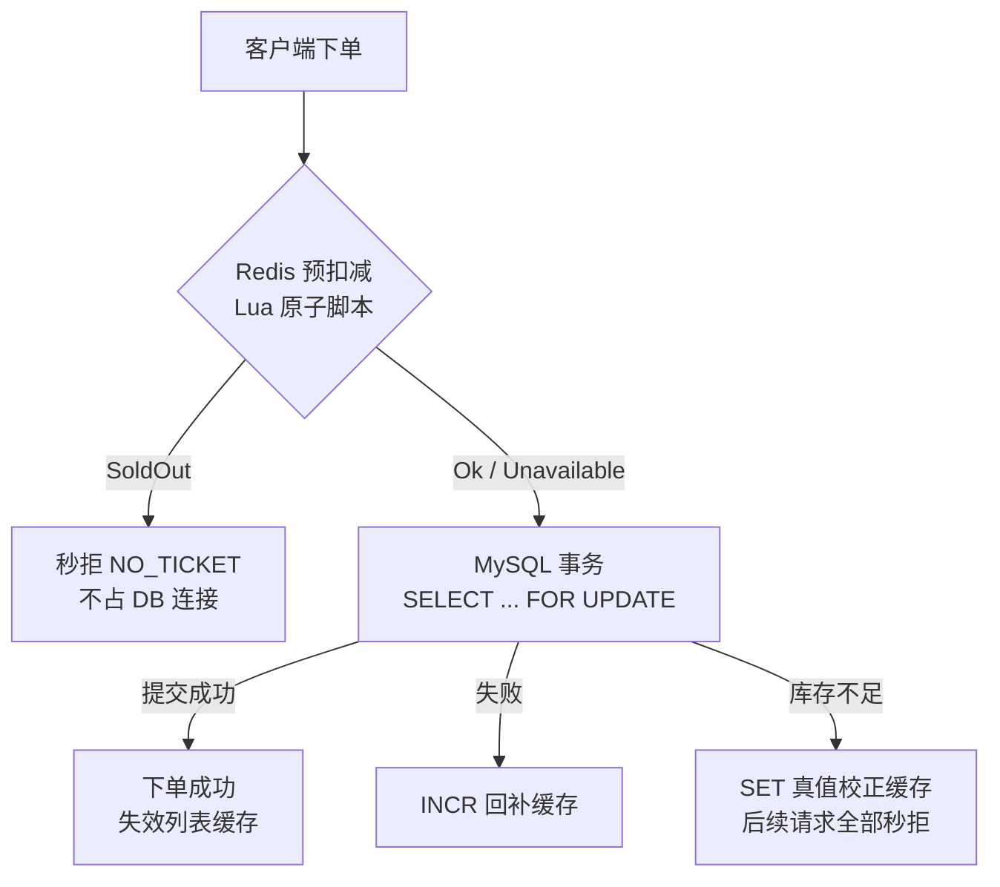

# Redis 高并发高可用架构

## 概述

在原有 Redis Session 持久化之上，新增 **Redis 库存缓存层**，将抢票热点从 MySQL 行锁前移到 Redis 原子操作，同时保证 Redis 故障时服务自动降级、绝不影响可用性。

## 组件

| 组件 | 位置 | 职责 |
|------|------|------|
| `IStockCache` | `backend/Domain/include/IStockCache.hpp` | Domain 层接口 + NoopStockCache 兜底 |
| `RedisStockCache` | `backend/Server/{include,src}/RedisStockCache.*` | Lua 原子预扣减、列表缓存、全操作 try/catch 降级 |
| `RedisConnPool` | `backend/Server/{include,src}/RedisConnPool.*` | 200ms 限时取连接、故障名额登记与自动补建 |

## Key 设计

- `stock:{ticketId}` — 剩余库存（string，1h TTL，view/下单持续回填）
- `cache:tickets:onsale` — 在售列表完整响应 JSON（5s TTL + 写操作主动失效）
- `session:{token}` — 会话（30min TTL，GETEX 原子续期）

## 一致性模型

**MySQL 永远是库存唯一真值**，Redis 只做预筛：

1. 预扣减 `Ok` → 继续走 DB 事务，行锁防超卖不变
2. 预扣减 `SoldOut` → 秒拒，不打 DB
3. 预扣减 `Unavailable`（未命中/Redis 故障）→ 降级直查 DB，成功后用真值回填
4. DB 事务失败 → `INCR` 补偿回缓存
5. DB 显示无票/下架 → `SET 0` 校正缓存
6. 取消订单 → `INCRBY quantity` 回补 + 失效列表缓存

缓存偏小是安全方向（多放请求去 DB，行锁兜底）；缓存偏大最多多放一轮请求到 DB，仍不会超卖。

## 高可用保证

- **Redis 完全宕机**：所有缓存操作 catch 异常返回 `Unavailable`/no-op，业务直连 MySQL，实测服务不中断（浏览/下单均正常）
- **连接池取连接 200ms 超时**：worker 线程绝不永久阻塞
- **连接名额登记**（`lostSlots_`）：故障期丢失的连接在 Redis 恢复后自动补建，池不缩水
- **worker 线程全局异常兜底**（ser.cpp）：任何业务异常转为 `INTERNAL` 响应，不再 `std::terminate` 杀进程
- **协议容错**（`getIntField`）：数字字符串/非法类型不再触发 jsoncpp 异常
- **登录 token 签发失败显式报错** `SESSION_UNAVAILABLE`，不返回假成功

## 压测结果（本机，io_threads=1 / worker_threads=8）

| 场景 | 结果 |
|------|------|
| 100 并发抢 20 张 | 成功恰好 20，拒绝 80，无超卖 |
| 200 并发抢 30 张 | 成功恰好 30，拒绝 170，无超卖 |
| kill Redis 后浏览/登录 | 正常（12ms 响应），进程存活 |
| 取消订单 | Redis 库存 0→1 实时回补 |

压测脚本：`python3 tools/bench_order.py <ticket_id> <并发数>`

## 配置

`config.json` 中 `redis.enabled: true` 同时启用 Redis Session 与库存缓存；`false` 时自动使用内存 Session + NoopStockCache，行为与旧版完全一致。

## 测试

- `test_stock_cache`（ctest 注册）：原子扣减、8 线程 320 请求抢 50 库存恰好成功 50、列表缓存；无 Redis 环境自动跳过
