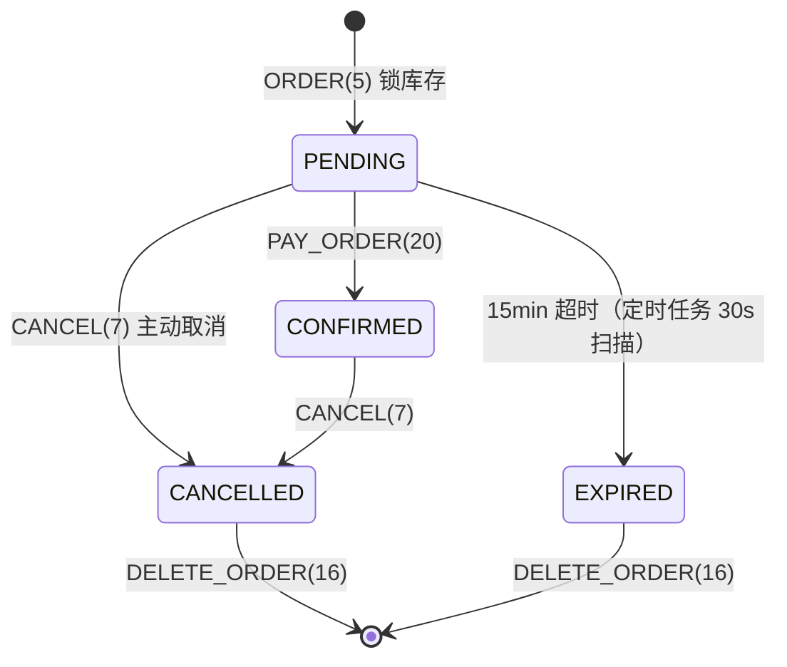

# HyperTicket v2 功能升级（大麦网式订票平台）

2026-07-16 完成的三端同步升级。参考大麦网的产品形态，为平台补齐了详情页、搜索筛选、待支付流程、多张购票、收藏与热门榜。

## 功能总览

| 功能 | 说明 | 协议 |
|------|------|------|
| 票品详情页 | 演出简介、购票须知、艺人、城市、封面 | `TICKET_DETAIL(19)` |
| 搜索与筛选 | 关键词（标题/场馆/艺人模糊匹配）+ 城市 + 分类组合筛选 | `VIEW(4)` + `keyword/city/category` |
| 待支付订单 | 下单先锁库存（PENDING），15 分钟支付窗口，超时自动回收 | `ORDER(5)` / `PAY_ORDER(20)` |
| 多张购票 | 单笔 1-6 张（`quantity`），Redis 预扣减与 DB 事务均按数量处理 | `ORDER(5)` + `quantity` |
| 收藏（想看） | 心形收藏、我的想看列表 | `FAVORITE(21)` / `VIEW_FAVORITES(22)` |
| 热门榜 | 按有效订单量（PENDING+CONFIRMED）排序 TOP N | `HOT_TICKETS(23)` |

## 数据库变更

迁移脚本 `db/migrate_v2.sql`（幂等，可重复执行）；全新部署直接用 `db/init.sql`。

- `tickets` 新列：`city`（城市，带索引）、`description`（详情）、`notice`（购票须知）、`artist`（艺人）
- `reservations` 新列：`expire_at`（支付截止时间，`(status, expire_at)` 复合索引）
- 新表 `favorites`：`(user_id, ticket_id)` 唯一约束，级联删除
- 种子数据 `db/seed_v2.sql`：19 条覆盖 10 城市 5 分类的真实感演出数据（演唱会/体育/话剧/展览/电影）

## 待支付订单生命周期



库存一致性：三条回补路径（主动取消 / 支付超时回收 / 下单事务失败补偿）都同时回补 MySQL 与 Redis `stock:{id}`，并失效列表缓存。MySQL 行锁仍是防超卖的唯一真值，Redis 只做预筛（详见 `docs/REDIS_HIGH_CONCURRENCY.md`）。

## 三端升级内容

### Web 前端（frontend/）
- `TicketDetail` 组件：详情弹层（简介/须知选项卡、数量步进器、想看按钮、选座/直购双入口）
- `TicketList`：分类 + 城市双行筛选、关键词 300ms 防抖搜索、热门推荐榜、卡片心形收藏
- `FavoriteList` 新页面：`/customer/favorites`（导航"我的想看"）
- `OrderList`：待支付状态徽标、每秒刷新的支付倒计时（mm:ss）、"去支付"按钮、总价展示
- Admin `TicketManage`：新增城市/艺人/详情/须知表单字段

### Tauri 用户端（clients/user-client/）
- types/api 与 Web 端同步（筛选、详情、支付、收藏、热门协议）
- `TicketList`：分类/城市筛选、票价展示、下单后提示去支付
- `OrderList`：待支付标签 + 去支付按钮
- 修复：`AuthLayout.css` 缺失导致 vite build 失败（从 frontend/ 补齐）

### Qt 管理端（clients/admin-client/）
- `TicketManagePage`：列表行展示 城市·场馆·日期·票价；新增表单加城市/艺人/票价字段

## 联调验证结果

17 项端到端回归全部通过：

- 登录 / 全量列表（22 票）/ 组合搜索（关键词+城市）/ SQL 注入安全（参数化查询）
- 下单 2 张 → PENDING → 支付 → CONFIRMED → 取消 → 删除记录
- 张数上限（quantity=9 拒绝）/ 重复支付拒绝 / 未登录越权拒绝
- 收藏增删查 / 热门榜 / 详情 404
- 60 并发下单全部成功且订单数与库存扣减严格一致
- 60 笔 PENDING 强制超时后定时任务全部回收，MySQL 与 Redis 库存同步恢复（400/400）
- WebSocket 桥接层透传新协议正常（Web 前端全链路可用）

## 升级部署步骤

```bash
# 1. 数据库迁移（存量库）
mysql -u root -p < db/migrate_v2.sql
mysql -u root -p < db/seed_v2.sql   # 可选：演示数据

# 2. 重新构建后端
cd build && cmake --build . -j$(nproc)

# 3. 重启服务
pkill -x ser; ./bin/ser &

# 4. Web 前端
cd frontend && npm run build

# 5. Tauri / Qt 客户端按各自 README 构建
```
